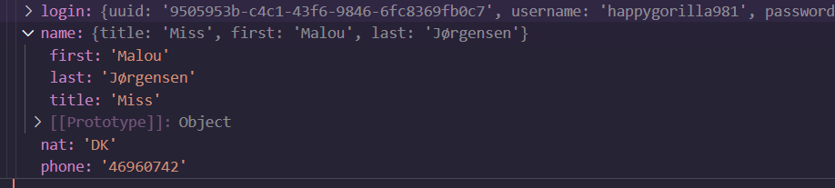

<h1><i>FETCH</i></h1>

In this project, I obtained random user data from an API using two different methods. The `veriGetir` function performs the asynchronous operation using async/await, while the `veriGetir2` function uses the Promise returned by fetch.

